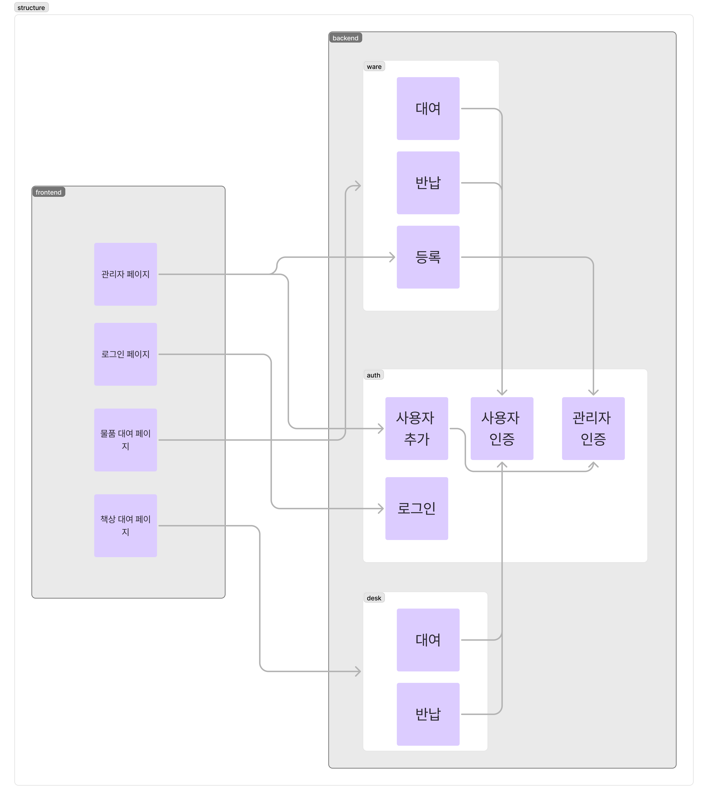

# KOSMOS :동아리 물품 및 시설 이용 관리 웹

# 아이디어 선정 이유

KOSMOS는 동아리명 KOSS와 “질서 있는 체계”를 의미하는 COSMOS를 결합한 이름으로, 기존의 불편했던 이용 방식을 개선하고, KOSMOS를 통해 동아리 물품과 시설을 더 체계적으로 관리할 수 있도록 하고자 합니다.  
동아리 방을 이용하려 할 때, 필요한 물품이 이미 대여 중이거나 좌석이 부족해 헛걸음을 하는 경우가 많습니다. 현재 KOSS 동아리 방에서는 물품 대여 내역을 문 옆에 수기로 작성하여 관리하고 있지만, 이를 체계적으로 운영하는 시스템이 없으며, 반드시 동아리 방을 방문해야만 이용 가능 여부를 확인할 수 있다는 불편함이 있습니다.  
따라서, 웹사이트를 통해 물품 대여 및 관리를 보다 효율적으로 운영하고, 책상 등의 시설 이용 현황도 온라인에서 확인할 수 있도록 함으로써 동아리 방 이용의 편의성을 높이고자 해당 아이디어를 선정하였습니다.

# 기대 효과

동아리 물품과 공간을 효율적이고 체계적으로 관리할 수 있으며, 웹 기반 시스템을 활용함으로써 많은 동아리 부원의 시간을 절약할 수 있습니다.  
또한, 기존의 수기 작성 방식에서 벗어나 데이터베이스를 활용하여 물품을 관리함으로써, 보다 정확한 기록이 가능해지고 분실이나 훼손 발생 시 상황을 쉽게 파악할 수 있습니다.  
더 나아가, 이 시스템을 기반으로 동아리 관리의 전산화를 이루어 차후 동아리 부원 모집, 프로젝트 관리, 홍보 등의 기능 확장을 기대할 수 있으며, 이를 통해 동아리를 더욱 체계적으로 운영할 수 있을 것입니다.

# 프로젝트 내용

## 기능

공간 대여  
회원 관리  
물품 대여 서비스

## 프로젝트 구조

### 백엔드

스터디를 통해 학습한 nodejs, express로 서버를 구축하였으며 데이터베이스는 MongoDB와 Atlas를 이용해 구축하였습니다.  
기능은 크게 사용자 관리, 물품 대여, 책상 대여로 나누어 구성하였습니다.

**사용자 관리**  
프론트엔드에서 로그인, 회원 추가, 비밀번호 수정을 할 수 있도록 라우터를 구성하였습니다. 또한 사용자 검증과 관리자 검증을 위한 미들웨어를 만들어 모든 기능을 동아리 부원들만 접근할 수 있도록 하고, 일부 기능은 관리자만 접근할 수 있도록 제한했습니다.

**책상 대여**  
책상 대여 기능을 통해 동아리 부원들이 동방 내 특정 테이블을 예약하여 사용할 수 있습니다.  
주간 단위로 예약이 가능하며 사용자가 예약한 시간 동안 테이블을 사용할 수 있도록 했습니다.책상 대여 현황 확인, 취소 페이지, 대여 페이지 등의 라우터를 구성하였습니다. 대여 취소 페이지는 본인의 대여에 한해서만 접근할 수 있도록 구성하였습니다.

**물품 대여**  
물품 대여 페이지로 이동, 대여 가능 물품을 보여주는 리스트, 물품 등록/대여/반납, 물품 수량 확인, 대여 로그 조회, 관리자 대시보드용 물품 정보 조회 등의 라우터를 구성하였습니다. 물품 등록과 대여 로그 조회, 관리자 대시보드용 물품 정보 조회는 관리자만 접근할 수 있도록 구성하였습니다.

## api table

| 이름 | 경로 | 요청 타입 | 리턴 타입 | 간단 설명 | 요청 형식 | 반환 형식 |
| ----- | ----- | ----- | ----- | ----- | ----- | ----- |
| **로그인** | /api/auth/login | POST | Bool |  | {     "studentId": "학번",     "password": "비밀번호" }  | {     "success":성공 여부,     "token": "토큰" }  |
| **회원 조회** | /api/auth/ | POST | Bool | 로그인 상태의 정보를 조회 | 헤더에 로그인 토큰을 넣고 요청 | {     "success": 성공 여부,     "user": {         "studentId": "학번",         "name": "이름",         "isAdmin": 관리자 여부,         "lastLoginAt": "2025-02-08T08:25:42.158Z"     } }  |
| **회원 삭제** | /api/auth/delete | POST | Bool |  | {     "studentId": "학번", } | { success: 성공 여부, message: “메세지”} |
| **회원 추가** | /api/auth/add | POST | Bool |  | {     "studentId": "학번",     "name": "이름",     "password": "비밀번호",     "isAdmin": "관리자 여부" }  | { success: 성공 여부, message: “메세지”}  |
| **회원 리스트 조회** | /api/auth/users | GET |  |  |  | {       success: true,       count: users.length,       data: users     }  |
| **회원 비밀번호 수정** | /api/auth/mod | POST | Bool |  | {     "studentId": "학번",     "newPassword": "비밀번호" } | { success: 성공 여부, message: “메세지”} |
| **동방 예약현황** | /api/desk/\<id\> | get | Bool | ID로 책상 구분 POST로 예약 시간대의 데이터를 받아와 예약 진행, 대여 반납의 여부는 데이터에 명시 | GET /api/book/desk/:id | {     "success": true,     "tableId": 1,     "week": "2024-02-12 \~ 2024-02-18",     "reservationStatus": {         "Monday": {             "1": "사용 가능",             "2": "예약됨",             "3": "예약됨",             ...         },         "Tuesday": { ... }     } } |
| 본인 동방 예약 현황 조회 | /api/desk | GET |  |  | header에 사용자 토큰 필요 | {     "success": true,     "reservations": \[         {             "deskId": 2,             "rentalDate": "2025-02-15T20:00:00.000Z",             "expectedReturnDate": "2025-02-15T20:00:00.000Z",             "status": "ACTIVE",             "isOverdue": false         },         {             "deskId": 2,             "rentalDate": "2025-02-09T16:00:00.000Z",             "expectedReturnDate": "2025-02-09T16:00:00.000Z",             "status": "ACTIVE",             "isOverdue": false         },         {             "deskId": 1,             "rentalDate": "2025-02-09T16:00:00.000Z",             "expectedReturnDate": "2025-02-09T16:00:00.000Z",             "status": "ACTIVE",             "isOverdue": false         }     \] }  |
| **동방 예약** | /api/desk/add | POST | Bool |  | {     "tableId": "1",     "reservation": \["Monday-10", "Tuesday-14"\] }  | {     "success": true,     "message": "예약이 완료되었습니다." } {     "success": false,     "message": "예약할 시간을 선택해주세요." }  |
| **동방 예약 취소** | /api/desk/cancel | POST | List |  | {     "tableId": "1",     "reservation": \["Monday-10", "Tuesday-14"\] }  | {     "success": true,     "message": "예약이 취소되었습니다." } {     "success": false,     "message": "취소할 시간을 선택해주세요." }  |
| **물품 대여 이동** | /book/ware | GET | Page |  |  |  |
| **대여가능물품** | /api/ware | GET | List |  |   |  |
| **물품 등록** | /api/ware/register | POST |  |  | {     "name": "새로운 물품",     "description": "새로운 물품에 대한 설명",     "quantity": 10 }  | { message: '물품 등록 성공', ware: newWare }  { message: '물품 등록 서버 오류' }  |
| **물품 대여** | /api/ware/borrow | POST |  |  | {     "wareName": "새로운 물품",     "returnDate": "2025-03-15" } | { success: true, message: '물품 대여 성공' }  |
| **물품 반납** | /api/ware/return | POST |  |  | {     "wareName": "새로운 물품" } | {             success: true,             message: '물품 반납 성공',         }  |
| **물품 수량 확인** | /api/ware/quantities | GET |  |  |  | { “물품 이름” : 수량 } |
| **관리자**  **대시보드용 물품 정보 조회** | /api/ware/dashboard/test | GET |  |  |  |  |
| **대여 물품 목록 조회** | /api/ware/borrowed | GET |  |  |  | {     "success": true,     "reservations": \[         {             "wareId": 4,             "wareName": "컴퓨팅 사고력을 키우는 이산수학",             "quantity": 0,             "rentalDate": "2025-02-09T09:59:39.232Z",             "expectedReturnDate": "2025-02-11T00:00:00.000Z",             "status": "ACTIVE",             "isOverdue": false         },         {             "wareId": 6,             "wareName": "자바의 정석 1",             "quantity": 0,             "rentalDate": "2025-02-09T10:00:53.679Z",             "expectedReturnDate": "2025-02-11T00:00:00.000Z",             "status": "ACTIVE",             "isOverdue": false         }     \] }  |

### 프론트엔드

로그인 화면  
로그인 페이지에서는 사용자가 학번과 비밀번호를 입력하면 이를 기반으로 관리자인지 일반 사용자인지를 확인하고, 그에 따라 일부 기능을 제한할 수 있도록 했습니다. (예: 관리자 페이지는 관리자만 접근 가능). 로그인 후,  JWT 토큰을 클라이언트 측에 저장하여 이후 요청 시 해당 토큰을 사용하여 인증을 진행하고, 사용자 정보를 요청하여 관리자인지 일반 사용자인지를 확인하는 방식입니다. 

물품 대여 화면  
일반 사용자는 대여 가능 물품 목록을 확인하고, “대여” 버튼을 통해 직접 대여할 수 있도록 구현했습니다. 대여한 물품은 반납 버튼을 통해 반납할 수 있으며, 물품의 남은 수량과 반납 예정일 등을 확인할 수 있도록 했습니다. 

동아리실 자리 예약 화면  
책상 대여 기능의 프론트엔드는 React를 기반으로 개발되었으며, 동아리 부원들이 동방 내 특정 테이블(큰 테이블 1개, 모니터 자리 3개)들을 요일별, 시간별로 예약하고 사용할 수 있도록 구현되었습니다. 사용자는 원하는 요일과 시간을 선택하여 자리를 예약할 수 있으며, 이미 예약된 시간에는 추가 예약이 불가능합니다. 예약 정보는 axios를 통해 백엔드와 주고받도록 구성되었습니다.

관리자 대쉬보드 화면  
관리자로 로그인하여 대시보드 화면에 접속하면 복지물품 사용 현황과 보유 수량을 확인하고, 새로운 물품을 등록할 수 있습니다. 사용자가 물품을 대여하면 해당 내역이 실시간으로 반영되며, 물품 등록을 통해 추가적인 수량을 즉시 반영할 수 있도록 구성하였습니다.

회원 가입 화면  
회원 가입 페이지는 관리자만 접근할 수 있도록 설정하였습니다. 사용자가 학번과 비밀번호를 관리자에게 제출하면, 관리자가 일괄적으로 회원을 추가할 수 있도록 구성하였습니다. 회원 추가 시 관리자 권한 부여 여부를 결정할 수 있으며, 아래 회원 목록에서 모든 회원 정보를 한눈에 확인할 수 있습니다. 

### 시연 영상

